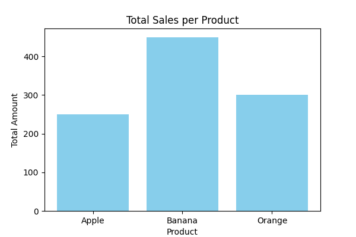

🧼 Data Cleaner Automation

A Python automation script for cleaning sales data, generating summaries, and visualizing results.

✨ Features
- Cleans tab-separated sales data (`sales.csv`)
- Converts `amount` column to integers and drops invalid rows
- Generates a product sales summary (`summary.txt`)
- Creates a bar chart visualization (`sales_chart.png`)
- Auto-renames output files to avoid overwriting
📂 Project Structure

🚀 How to Run
1. Clone or download this repository.
2. Place your `sales.csv` file in the folder.
3. Run the script:
   ```bash
   python data_cleaner.py

🌳Project Structure Section
data-cleaner/
├─ sales.csv
├─ data_cleaner.py
├─ sales_cleaned.csv
├─ summary.txt
└─ sales_chart.png

📊 Sample Output


✨Future Improvements:
- Add CLI arguments (e.g. python data_cleaner.py --file sales.csv)
- Package as installable Python module
- Add GUI for non‑technical users
- Support multiple input formats (CSV, Excel)d

🛠️ Tech Stack
- Python
- Pandas
- Matplotlib

📌 About
This project is part of my portfolio showcasing automation scripts for data cleaning and visualization.
Created by Henricho Capati.
